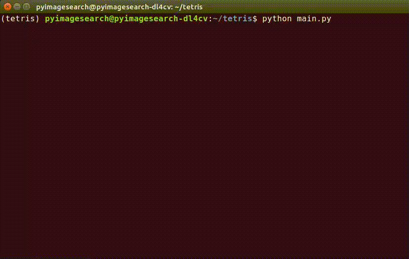

# Tetris Clone

A tetris clone terminal game written in Python3 using the curses module.




## Getting Started


### Prerequisites

Python >=3.5.2

### Running the program

To run the program, type

```
python main.py
```

For best results, use Ubuntu's GNOME terminal and a monospace font.

Monospace font can be achieved by:
```
> open terminal
> edit profile preferences
> general tab
> tick custom font
> monospace of your choice
```

### Controls

Directional keys:
* right, left, down move the piece in that direction
* up rotates the piece clockwise

q/y/n:
* q quits at any time
* y/n allow continuing or quitting after a loss


